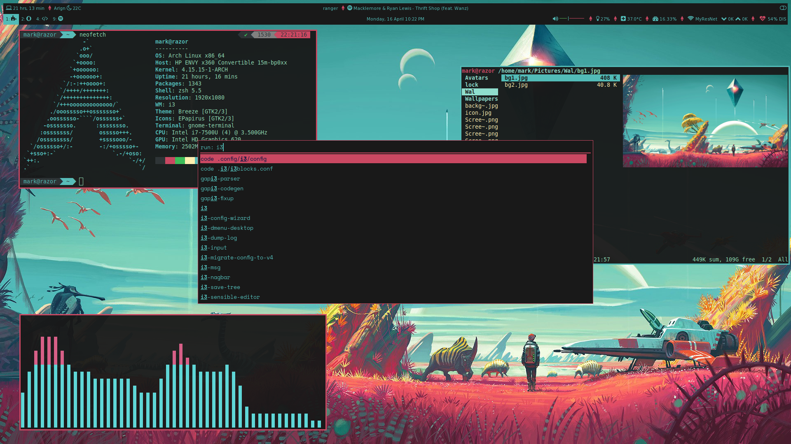
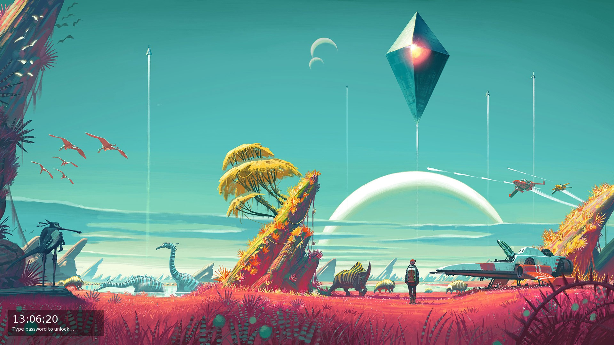
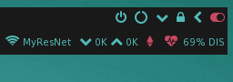
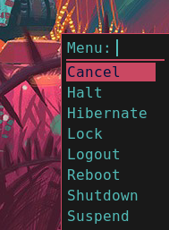
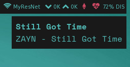

# No Man's Sky Rice - i3wm

Power Menus:

Notifications:

i3Blocks:

----
#### Pre-reqs:
* [i3 gaps](https://github.com/Airblader/i3)...obviously
* [i3blocks](https://github.com/vivien/i3blocks) and it's dependencies
* [rofi](https://github.com/DaveDavenport/rofi) or [dmenu](https://wiki.archlinux.org/index.php/dmenu) which ever you prefer 
* [ranger](https://github.com/ranger/ranger)
* [feh](https://feh.finalrewind.org)
* [w3m](https://www.archlinux.org/packages/extra/x86_64/w3m/) to preview images in ranger
* [Python-PyWal](https://github.com/dylanaraps/pywal)
* [Betterlockscreen](https://github.com/pavanjadhaw/betterlockscreen) and it's dependencies
* [compton](https://wiki.archlinux.org/index.php/Compton) for smooth transitions
* [polybar](https://github.com/jaagr/polybar) and it's dependencies if you plan to use that.
* [CLI-Visualizer](https://github.com/dpayne/cli-visualizer)

#### Terminal:
* [gnome-terminal](https://aur.archlinux.org/packages/gnome-terminal-transparency/)
* [zsh](https://wiki.archlinux.org/index.php/zsh)
* [oh-myzsh](http://ohmyz.sh)
* [powerlevel9k](https://github.com/bhilburn/powerlevel9k)

#### Scripts:
* [Spotify](https://github.com/firatakandere/i3blocks-spotify) 
script for i3 blocks
* [Weather](https://github.com/icemodding/i3/tree/master/scripts) 
script for i3blocks
* [Powermenu](https://github.com/vivien/i3blocks-contrib/tree/master/shutdown_menu) 
which uses rofi or zenity
* [Uptime](https://github.com/mohabaks/dotfiles/blob/master/config/polybar/.config/polybar/uptime)

You don't need to download the scripts separately...just saying where I got 
the scripts from. I've changed some stuff in the scripts, and I've kept the headers in the files if
they had any so you can check out their work if you want.

----
#### Note:
* Change $bat_number in .i3/scripts/battery accordingly
* Shutdown menu/Powermenu won't work if you decided to use dmenu and not get rofi (unless you have zenity)
* Log out and back in for lockscreen to change the wallpaper

#### Wallpaper:
If that's all you need...

...and if colors are all you need...

* Verdigris: #52bbb7 (the one that looks kind of blue)
* Darkterracotta: #ca4862 (the one that looks kind of pink)
