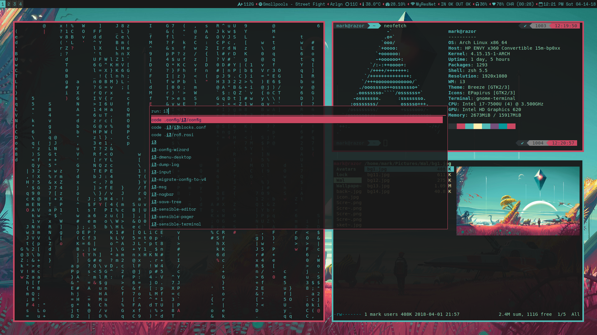

# No Man's Sky Rice - i3wm

----
#### Pre-reqs:
* [i3 gapps](https://github.com/Airblader/i3)...obviously
* [i3blocks](https://github.com/vivien/i3blocks) and it's dependencies
* [rofi](https://github.com/DaveDavenport/rofi) or [dmenu](https://wiki.archlinux.org/index.php/dmenu) which ever you prefer 
* [ranger](https://github.com/ranger/ranger)
* [feh](https://feh.finalrewind.org)
* [w3m](https://www.archlinux.org/packages/extra/x86_64/w3m/) to preview images in ranger
* [Python-PyWal](https://github.com/dylanaraps/pywal)
* [Betterlockscreen](https://github.com/pavanjadhaw/betterlockscreen) and it's dependencies
* [compiz](http://www.compiz.org) for smooth transitions

#### Terminal:
* [gnome-terminal](https://aur.archlinux.org/packages/gnome-terminal-transparency/)
* [zsh](https://wiki.archlinux.org/index.php/zsh)
* [oh-myzsh](http://ohmyz.sh)
* [powerlevel9k](https://github.com/bhilburn/powerlevel9k)

#### Scripts:
* [Spotify](https://github.com/firatakandere/i3blocks-spotify) 
script for i3 blocks
* [Weather](https://github.com/icemodding/i3/tree/master/scripts) 
script for i3blocks
* [Powermenu](https://github.com/vivien/i3blocks-contrib/tree/master/shutdown_menu) 
which uses rofi or zenity

You don't need to download those...just saying where I got 
the scripts from.

----
#### Note:
* All files and folders in .config to into $HOME/.config and 
others in your $HOME
* Change location under weather in .i3/i3blocks.conf
* Change $bat_number in .i3/scripts/battery accordingly
* Shutdown menu/Powermenu won't work if you decided to use dmenu and not get rofi (unless you have zentiy)
* Log out and back in for lockscreen to change the wallpaper

#### Wallpaper:
If that's all you need...

